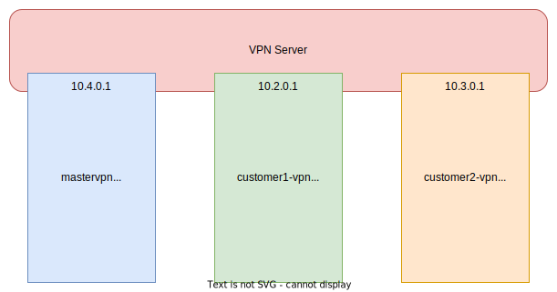

The [ZERO AMPS Nodes](https://www.zero-iee.com/de/products/) do not have an internet connection by default, but in some cases we equip them with a mobile module so that we can update, maintain or troubleshoot them remotely. 

To establish a secure connection to our own infrastructure, we mostly use [Wireguard](https://www.wireguard.com) VPNs. Wireguard VPNs are very lightweight, perform well and experience has shown them to be very robust - especially in combination with mobile connections. The Wireguard client on the AMPS nodes connects to our central VPN server. Our developers also use this to establish a connection so that they can connect to the respective AMPS node. 

<!--more-->

However, as we have different customers with projects of different sizes and do not want to compromise on data security, we have separated our VPN networks according to customer and project:

Customer A will never be able to come into contact with customer B's devices - this is ensured by the individual VPN networks and our firewall rules, which restrict data traffic within the VPNs and beyond. It is essential to prevent a compromised device from gaining control over all nodes, including those belonging to other customers. 

As a rule, it is therefore not possible for a node to communicate from a customer VPN. However, there is one exception: a separate "master VPN" (`mastervpn`) allows our developers to reach devices of _all other_ VPNs via this VPN. So instead of having to deal with many different Wireguard profiles, it is sufficient for our developers to establish a connection with this one master VPN. 

Our network topology looks something like this: 




The firewall rules on the VPN server before implementing the security measures:

```
root@vpnserver:~# iptables -L -v
Chain INPUT (policy ACCEPT 0 packets, 0 bytes)
 pkts bytes target     prot opt in     out     source               destination         

Chain FORWARD (policy ACCEPT 0 packets, 0 bytes)
 pkts bytes target     prot opt in     out     source               destination                 

Chain OUTPUT (policy ACCEPT 0 packets, 0 bytes)
 pkts bytes target     prot opt in     out     source               destination 
```

_(The reason for the void: another firewall is located outside the VPN server and is already filtering incoming connections)_


These rules now had to be expanded so that the following requirements were met:

* An AMPS node in one of the wireguard networks may only communicate with other AMPS nodes (or the server interface) of its own VPN subnet. 
* A device in the `mastervpn` Wiregard network may communicate with _any_ AMPS nodes in _all_ Wireguard networks. 


To enable communication / packet forwarding across network boundaries (e.g. `mastervpn` => `customer1-vpn` or `mastervpn` => `customer2-vpn`), IPv4 forwarding must first be activated in the Linux kernel. Temporarily via 

	sysctl -w net.ipv4.ip_forward=1

... or permanently by adjusting the file `/etc/sysctl.conf`:

	net.ipv4.ip_forward=1

Followed by a 

	sysctl -p

By default, every network interface can now forward data packets to every other network interface. Clients of different Wireguard networks could therefore - if they are configured appropriately on the client side - talk to each other. However, this behavior should _not_ normally be allowed here. Therefore, the default firewall rule for the "FORWARD" chain of the "Filter" table is set to "DROP":

	iptables -P FORWARD DROP

However, we must allow forwarding in one case - namely in the event that a request is sent from the `mastervpn` to one of the customer VPNs. Forwarding was previously activated for this case:

	iptables -A FORWARD --in-interface mastervpn --out-interface customer1-vpn -j ACCEPT
	iptables -A FORWARD --in-interface mastervpn --out-interface customer2-vpn -j ACCEPT


To enable devices from the relevant customer VPN to respond, another firewall rule is important, which ensures that AMPS nodes from the customer VPN are allowed to send packets to another wireguard network (`mastervpn`) in one case. Namely, if it is a response to a previously received request from `mastervpn`:

	iptables -A FORWARD --out-interface mastervpn -m state --state ESTABLISHED,RELATED -j ACCEPT


So far, we have only looked at the `FORWARD` rules. However, one case falls through the cracks: What if a packet does not need to be forwarded but has already reached its destination? This is the case, for example, if the _Wireguard Server-IP_ of `customer2-vpn` is addressed from `customer3-vpn`. As the server itself is addressed here - despite the different IP address - no forwarding is used and such communication is not prevented by the previous rules.

If we want to prevent such requests, an `INPUT` rule must be created for each of the VPNs, e.g:

	iptables -A INPUT -d 10.4.0.1 ! --in-interface mastervpn -j REJECT
	iptables -A INPUT -d 10.2.0.1 ! --in-interface customer1-vpn -j REJECT
	iptables -A INPUT -d 10.3.0.1 ! --in-interface customer2-vpn -j REJECT

For example, `10.4.0.1` is the IP address that is used within the `mastervpn` for the server itself. The same applies to the other two rules for the `customer` VPNs.

Firewall rules after implementing the security measures:

```
root@vpnserver:~# iptables -L -v
Chain INPUT (policy ACCEPT 5621 packets, 1148K bytes)
 pkts bytes target     prot opt in     out     source               destination         
    7   588 REJECT     all  --  !mastervpn any     anywhere             10.4.0.1             
    0   0   REJECT     all  --  !customer1-vpn any     anywhere             10.2.0.1            
    0   0   REJECT     all  --  !customer2-vpn any     anywhere             10.3.0.1                
reject-with icmp-port-unreachable

Chain FORWARD (policy DROP 17 packets, 1428 bytes)
 pkts bytes target     prot opt in     out     source               destination                   
    2   168 ACCEPT     all  --  mastervpn customer1-vpn  anywhere             anywhere            
  207 17201 ACCEPT     all  --  mastervpn customer2-vpn  anywhere             anywhere            
   38  4692 ACCEPT     all  --  any    mastervpn  anywhere             anywhere             state RELATED,ESTABLISHED

Chain OUTPUT (policy ACCEPT 6708 packets, 1425K bytes)
 pkts bytes target     prot opt in     out     source               destination
```


This would pave the way through the firewall for our AMPS customer devices. 

Only one thing is still missing: routing information in the event that someone accesses one of the AMPS nodes in the `customer` VPNs from the `mastervpn`. It must be specified where response packets should be sent. Finally, the devices only see one IP address from the mastervpn range, e.g. `10.4.0.0/24`. As only routing information for their own subnet is available by default, we have to show them the way to 10.4.0.0/24. To do this, an entry for `AllowedIPs` is added in the respective Wireguard configuration on the AMPS node:

For example

	AllowedIPs = 10.3.0.0/16

becomes

	AllowedIPs = 10.3.0.0/16,10.4.0.0/24

It is therefore clear to the affected Wireguard client from the customer network that not only packets for its own SU network should be routed via the server, but also (response) packets to the `mastervpn` network `10.4.0.0/24`.

After reloading the client configuration using `systemctl restart wg-quick@customer1-vpn`, the change is active and the routing information should be available:

	ip route


_Note: The above iptables settings are **not** persistent! To restore them after a reboot, we recommend persisting iptables rules using `netfilter-persistent`._