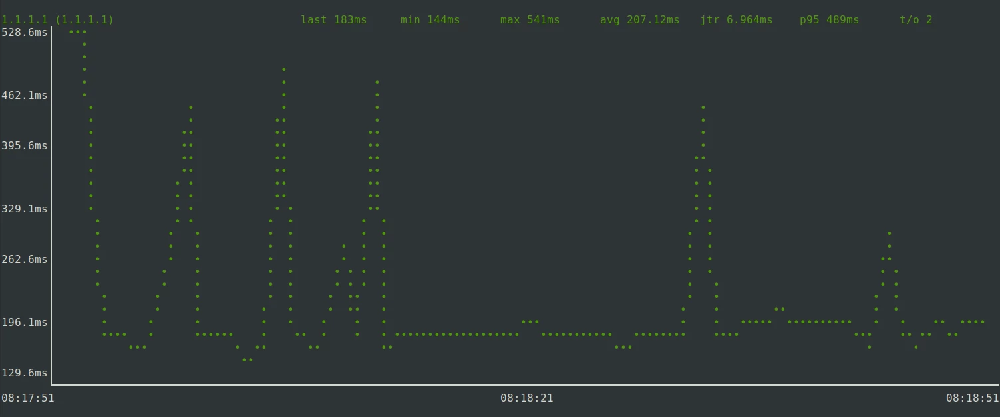

We took a closer look at the "Waveshare SIM7070G Cat-M/NB-IoT/GPRS HAT" for the Raspberry Pi and put it into operation. We uncovered various pitfalls and describe below how we set up the NB-IoT modem to connect one of our [#AMPS nodes](https://www.zero-iee.com/de/products/) to the internet. 

* Hardware: 
	* Raspberry Pi 4 B
	* Mobilfunk-HAT: [Waveshare SIM7070G Cat-M/NB-IoT/GPRS HAT](https://www.waveshare.com/wiki/SIM7070G_Cat-M/NB-IoT/GPRS_HAT) 
	* SIM-Karte: Telekom M2M
* Software: Raspbian 12 "Bookworm" 


<!--more-->


## Connecting the modem to the Raspberry Pi


Like any other HAT module, the modem is connected to the Raspberry Pi 4 B via the Raspberry pin header. In addition, we have connected the module to the Raspberry Pi via the USB cable supplied in order to check whether the serial console works as expected as a first step.

The USB cable can be dispensed with later.


## Supply the modem with power

The mobile modem is obviously connected to one of the GPIO pins of the Raspberry Pi. The modem is switched on or off by activating GPIO pin 4. After starting, the pin should first be switched to a low level so that a high level is present at the SimCom modem (due to an NPN transistor on the module). The high level should be permanently present at the input if _no_ action is required. However, if a switch-on or switch-off action is required, a low level must be applied to the SimCom Modem for at least one second (switch on) or 1.2 seconds (switch off) before switching back to a high level.

The initial switching to the high level can be carried out as follows:

	echo "4" > /sys/class/gpio/export
	sleep 0.1
	echo "out" > /sys/class/gpio/gpio4/direction
	echo "0" > /sys/class/gpio/gpio4/value

_Reminder: "0" causes a low level on the NPN transistor and therefore an inverted "high" level on the modem!_

This command sequence is packed into the file `/etc/rc.local` before the `exit 0` instruction and thus executed once after each boot. By default, the modem should start after it has been supplied with power.

If the modem is to be explicitly switched on or off, the input must - as already mentioned - be pulled to a low level on the modem for at least 1.2 seconds. This is achieved by applying a short high level to the module inputs. 

To switch the power supply, we create a script `/home/pi/powertoggle.sh` which contains the following sequence:

```
#!/bin/bash
echo "1" > /sys/class/gpio/gpio4/value
sleep 1.2
echo "0" > /sys/class/gpio/gpio4/value
```

If the script is executed once, the modem starts. If it is executed again, it is shut down.

Normally, this `powertoggle.sh` script does not need to be executed after starting, as the modem starts automatically. However, if no serial connection is established, it may help to switch the power supply once by executing the script.


## Check serial connection to the modem

Communication with the mobile modem takes place exclusively via a serial connection, which is provided within USB. The bandwidth of the interface is very limited, but completely sufficient in the NB-IoT application, as the available bandwidth in the mobile network is minimal anyway and is only suitable for transmitting very small amounts of data (status information, sensor data, commands, ...).

Our modem identifies itself at the USB port with USB Vendor ID `1e0e` and Product ID `9206`:

```
pi@raspberrypi:~ $ lsusb
Bus 002 Device 001: ID 1d6b:0003 Linux Foundation 3.0 root hub
Bus 001 Device 020: ID 1e0e:9206 Qualcomm / Option SimTech SIM7080 <------ SIM7070 Modem
Bus 001 Device 002: ID 2109:3431 VIA Labs, Inc. hub
Bus 001 Device 001: ID 1d6b:0002 Linux Foundation 2.0 root hub
```

According to the data sheet ([SIM7070_SIM7080_SIM7090 Series_Linux_Application Note_V1.02](https://www.simcom.com/product/SIM7070G.html)), the modem offers the following interfaces via USB:

* 0: (USB serial): Diagnostic interface
* 1: (USB serial): GPS NMEA interface
* 2: (USB serial): AT port interface
* 3: (USB serial): QFLOG interface
* 4: (USB serial): DAM interface
* 5: (USB serial): Modem port interface

The port assignment may differ depending on the product ID - it may therefore be worth taking a look at the data sheet. However, the most important interface for this article is always in position 2: the AT port interface. 

As is usual in the mobile radio sector, this mobile radio modem is also controlled via so-called AT commands on a serial interface. The Linux kernel from mainline kernel 5.8.10 contains the [necessary adjustments](https://elixir.bootlin.com/linux/v5.8.10/source/drivers/usb/serial/option.c#L1827) in the USB options driver, which provides the aforementioned serial interfaces via USB.

To test the AT interface, it is sufficient to establish a connection using Minicom. Minicom is installed for this purpose:

	sudo apt install minicom

... and started:

	sudo minicom -b 115200 -D /dev/ttyUSB2

You can then start Minicom by entering 

	AT

to check whether AT commands are accepted. This ensures that we are talking to the correct console. If an "OK" is returned, everything is OK and the modem is responding to our commands. 

Minicom can be exited again via `CTRL+A` and `X`. 


## Switch to the Raspberry Pi's own serial interface

If we are sure that the USB-based serial communication with the modem works, we can also switch to the Raspberry Pi's own serial interface `ttyS0`. This has the great advantage that there no longer needs to be a USB connection between the Raspi and the Waveshare module: The USB cable can be removed. 

On the Raspberry Pi, the serial console still needs to be activated and set appropriately.
To do this, select "03 Interface options" and then "I5 Serial Port" in the `raspi-config` tool. Settings:

* Login Shell: NO
* Serial Port Hardware enabled: YES

Important: "Login shell" must be set to `NO`. Otherwise, communication problems with the modem may occur. Finally, restart the Raspi once to activate the settings. 

From now on, serial communication via the `/dev/ttyS0` interface should also be possible. As in the case above, Minicom can be used again to check the connection. 

Tip: If a response to the "AT" command does not appear immediately, a new input can lead to success. More on this in the section _"Modem does not respond: An auto bauding problem"_.


## Open an IP data channel with PPP

To obtain an IP address from the mobile phone provider, a PPP registration must be carried out. We use a Telekom M2M (Machine-to-Machine) SIM card, which supports the Telekom NB-IoT network. The PPP information given below is suitable for the Telekom M2M network and possibly also for that of some resellers. For other providers, APN or possibly more configuration parameters must be adapted. 

We establish the PPP connection via the PPP daemon `pppd`, which is installed as follows: 

	sudo apt install ppp

The PPP daemon must be configured in two places. Let's start with the provider configuration, which is created in `/etc/ppp/peers/telekomM2M`:

```
user "m2m"
connect "/usr/sbin/chat -v -f /etc/chatscripts/telekomM2M -T internet.m2mportal.de"

# Serial device to which the modem is connected.
/dev/ttyS0

# Speed of the serial line.
115200

nocrtscts
debug
nodetach
ipcp-accept-local
ipcp-accept-remote

# Assumes that your IP address is allocated dynamically by the ISP.
noipdefault

# Try to get the name server addresses from the ISP.
usepeerdns

# Use this connection as the default route.
defaultroute

# Makes pppd "dial again" when the connection is lost.
persist
maxfail 0
holdoff 5

# Do not ask the remote to authenticate.
noauth
```


* `/etc/chatscripts/telekomM2M` is the name of the "chat script" for communication with the modem
* `internet.m2mportal.de` is the APN name of the M2M network

As the chat script `/etc/chatscripts/telekomM2M` does not yet exist, it will now be created:

```
ABORT   "BUSY"
ABORT   "VOICE"
ABORT   "NO CARRIER"
ABORT   "NO DIALTONE"
ABORT   "NO DIAL TONE"
ABORT   "NO ANSWER"
ABORT   "DELAYED"
ABORT   "ERROR"

TIMEOUT 5

''  AT
'OK' AT
OK  ATE1
OK  AT+CGDCONT=1,"IPV4V6","\T","",0,0
OK  ATD*99#
TIMEOUT 22
CONNECT ''
```

As with the previous configuration file: This chat script may only work for the "Telekom M2M" network of Deutsche Telekom. We are currently unable to say for sure whether it works in the same or a similar way for other providers. However, it may also be possible to use it for other providers such as Vodafone. 

By the way: We have built a second "AT" query into this script to avoid a timing problem. More on this later under "A timing problem".

Now that both configuration files are ready, we can bring the modem to life. Make sure that the serial console `/dev/ttyS0` is no longer used by Minicom or a similar terminal and run the following command on the Raspberry Pi:

	sudo pppd call telekomM2M

The PPP daemon now attempts to log on to the network. If it is successful, it obtains an IP address and other information about a mobile data connection from the PPP server. A new network interface `ppp0` is set up in the background. This can be traced in a second console window:

```
pi@raspberrypi:~ $ ip addr
[...]

22: ppp0: <POINTOPOINT,MULTICAST,NOARP,UP,LOWER_UP> mtu 1500 qdisc pfifo_fast state UNKNOWN group default qlen 3
    link/ppp 
    inet 10.155.22.50 peer 10.64.64.64/32 scope global ppp0
       valid_lft forever preferred_lft forever
```

The (private) IP address `10.155.22.50` is available at the interface and can now be used for communication with other network participants or on the Internet:

	ping -I ppp0 1.1.1.1

**If pings do not come through immediately: Don't worry!** The NB-IoT M2M network is not optimised for latency. At our location, it takes approx. 7 seconds for the first data packets to come back. The latency then slowly improves with each data packet until we are approaching 100 ms.

```
pi@raspberrypi:~ $ ping -I ppp0 1.1.1.1
PING 1.1.1.1 (1.1.1.1) from 10.155.22.50 ppp0: 56(84) bytes of data.
64 bytes from 1.1.1.1: icmp_seq=2 ttl=51 time=7002 ms
64 bytes from 1.1.1.1: icmp_seq=3 ttl=51 time=5978 ms
64 bytes from 1.1.1.1: icmp_seq=4 ttl=51 time=5337 ms
64 bytes from 1.1.1.1: icmp_seq=5 ttl=51 time=4313 ms
64 bytes from 1.1.1.1: icmp_seq=8 ttl=51 time=2297 ms
64 bytes from 1.1.1.1: icmp_seq=9 ttl=51 time=2316 ms
64 bytes from 1.1.1.1: icmp_seq=10 ttl=51 time=1315 ms
64 bytes from 1.1.1.1: icmp_seq=11 ttl=51 time=433 ms
64 bytes from 1.1.1.1: icmp_seq=12 ttl=51 time=392 ms
64 bytes from 1.1.1.1: icmp_seq=13 ttl=51 time=393 ms
64 bytes from 1.1.1.1: icmp_seq=14 ttl=51 time=231 ms
64 bytes from 1.1.1.1: icmp_seq=15 ttl=51 time=429 ms
64 bytes from 1.1.1.1: icmp_seq=16 ttl=51 time=268 ms
64 bytes from 1.1.1.1: icmp_seq=17 ttl=51 time=347 ms
64 bytes from 1.1.1.1: icmp_seq=18 ttl=51 time=546 ms
64 bytes from 1.1.1.1: icmp_seq=19 ttl=51 time=163 ms
64 bytes from 1.1.1.1: icmp_seq=20 ttl=51 time=282 ms
64 bytes from 1.1.1.1: icmp_seq=21 ttl=51 time=283 ms
64 bytes from 1.1.1.1: icmp_seq=22 ttl=51 time=139 ms
64 bytes from 1.1.1.1: icmp_seq=23 ttl=51 time=116 ms
64 bytes from 1.1.1.1: icmp_seq=24 ttl=51 time=135 ms
64 bytes from 1.1.1.1: icmp_seq=25 ttl=51 time=154 ms
64 bytes from 1.1.1.1: icmp_seq=26 ttl=51 time=173 ms
^C
--- 1.1.1.1 ping statistics ---
27 packets transmitted, 23 received, 14.8148% packet loss, time 26180ms
rtt min/avg/max/mdev = 116.182/1436.578/7001.561/2066.895 ms, pipe 7
```


The two DNS servers obtained from the PPP daemon are listed in `/etc/resolv.conf`: 

```
pi@raspberrypi:~ $ cat /etc/resolv.conf
nameserver 10.74.210.210
nameserver 10.74.210.211
```


This means that name resolution is also available via the Telekom DNS server.

Information such as assigned IP address, DNS server and gateway ("remote IP address") is also written to the ppp daemon log output:

```
[...]
local IP address 10.155.22.50
remote IP address 10.64.64.64
primary DNS address 10.74.210.210
secondary DNS address 10.74.210.211
[...]
```

... which unfortunately does not apply to the public IPv6 address assigned to the modem: This can only be found in the output of `ip addr show dev ppp0`. Nevertheless, IPv6 is also available: 

	ping -I ppp0 2001:4860:4860::8888


If you now want to use the M2M network for all your Internet traffic, you can change the default route to this:

```
sudo ip route del default 
sudo ip -6 route del default
sudo ip route add default via 10.64.64.64 dev ppp0
sudo ip -6 route add default via fe80::1:2:47b1:3706 dev ppp0
```

The IPv4 gateway address `10.64.64.64` was taken from the ppp log - the IPv6 counterpart `fe80::1:2:47b1:3706` was taken from the IPv6 routing information using `ip -6 route`.
	

**By the way**: the PPP daemon seems to handle the resolver entries in `/etc/resolv.conf` relatively ruthlessly and simply overwrites existing entries. If the default route is left on the Ethernet interface, for example, it is possible that no DNS resolver can be reached and name resolutions will fail. In this case, a subsequent correction of `resolv.conf` provides a remedy. 


## Autostart for the PPP daemon

By default, the ppp package in Debian does not include a systemd service for the PPP daemon - but no problem! The package maintainers of Arch Linux have created a suitable [service file](https://gitlab.archlinux.org/archlinux/packaging/packages/ppp/-/blob/main/ppp.systemd?ref_type=heads):

```
[Unit]
Description=PPP link to %I
Before=network.target

[Service]
Type=notify
ExecStart=/usr/sbin/pppd call %I nodetach nolog up_sdnotify

[Install]
WantedBy=multi-user.target
```

We can save this under `/etc/systemd/system/ppp@.service` and include the daemon in the boot autostart:

	sudo systemctl daemon-reload
	sudo systemctl enable ppp@telekomM2M.service

`telekomM2M` is the name of the file `/etc/ppp/peers/telekomM2M`. The part must be adapted accordingly if the PP configuration file is named differently. Accordingly, if several provider configs are used, a `sudo systemctl enable ppp@provider2.service` could also be called up, for example. 

The PPP daemon can of course also be started via a systemd "start" command: 

	sudo systemctl start ppp@telekomM2M.service


## Modem does not respond: An auto bauding problem

During our experiments with Waveshare's SIM7070G-based cellular module, we encountered a timing problem. We could solve it, but it wasn't trivial to find, so let's take a quick look at it. 

### Symptoms

During the first steps with the module, we did not use the native serial interface, but took the diversions via the USB-to-serial adapter. So Raspi => USB connection of the module. With this setup, the PPP daemon worked perfectly and we were able to establish an Internet connection. 

Later, we switched to the native serial connection - i.e. without the USB port - and used the `/dev/ttyS0` interface under Linux instead of `/dev/ttyUSB2` to establish communication via the Raspi header. However, the PPP daemon could no longer establish a connection from this point onwards and terminated with a timeout. 

In this case, we were still able to get the modem to communicate under one condition: Namely, if we connected to the interfaces with a serial console (e.g. Minicom) before executing the PPP daemon and executed the "AT" command once or several times to get an "OK" back. The modem responded and when the PPP daemon was restarted, a connection could finally be established. Switching on with a terminal emulator therefore seemed to fix the connection. 

### The cause 

By systematically trying out and fixing the baud rate on the modem, we were finally able to find the cause: The modem's "auto-baud" feature - by all appearances in conjunction with a timing problem. 

The modem is set at the factory so that it does not accept a fixed baud rate, but attempts to recognise and set the baud rate itself with the first "AT" command. For example, if you set your Minicom tool to a baud rate of 115200 and connect to the serial interface, the execution of "AT" will also cause the modem to set itself to 115200 baud. This also explains why we were never able to get the PPP daemon to work with a different baud rate after such a step. The first connection and its baud rate are decisive after sending "AP". 

So the first thing the modem had to get from our Raspi was an "AT" string in order to be able to configure its own baud rate appropriately. In the next step, we checked our chat script and realised that the first command was indeed an "AT" command. So everything was fine?

Not quite. We eventually found out that we may be running into a timing problem at this point. This is because the documentation for another mobile radio module from the same manufacturer, SimCom, mentions the auto-baud feature, which states that after the first "AT" there should be a wait before further commands are sent. Otherwise, the following commands may no longer be interpreted correctly. 

### The solution

As the ChatScript syntax does not seem to recognise a "sleep" command or similar, we have simply added a second "AT" query to gain some time. 

```
'' AT
'OK' AT
```

And indeed - we were now able to communicate with the modem via the native serial interface - without having to connect via Minicom first. The PPP daemon ran immediately after booting. 

But why did it work perfectly via the USB serial connection? We suspect that the conversion from and to USB causes enough delay in the system so that the timing problem does not occur in this case. 


## A better solution for power management

At the beginning of this article we already described that the SIM7070G module can be switched on or off via GPIO4 of the Raspberry Pi. However, we failed to mention that we always switch the pin in our `powertoggle.sh` script to a high level for one second (resulting in a low level on the SIM7070G modem).

In fact, the data sheet of the mobile modem reveals the following:

* Low level for at least 1.0 second: Switch on
* Low level for at least 1.2 seconds: Switch off.

We can therefore not only "switch over" and reverse a possibly unknown initial state to its opposite, but also specifically bring about an "on" or "off" state through precise timing when switching. 

We initially experimented with bash commands, but realised relatively quickly that the timing of the bash shell is too imprecise to switch on or off reliably. We therefore implemented a small tool `modemctl` in C, which can accept "init", "on" and "off" arguments and control the GPIO4 output of the Raspi with corresponding precision:

Source code `modemctl.c`:

```
/*
 * modemctl: Controls Waveshare NB-IoT power state by controlling GPIO pin
 * Installing dependencies: sudo apt install pigpio
 * Compiling: gcc -o modemctl modemctl.c -l pigpio 
 * Running: sudo ./modemctl init 
 *          sudo ./modemctl on 
 *          sudo ./modemctl off
 */
#include <stdio.h>
#include <string.h>
#include <pigpio.h>

#define GPIO_PIN 4      // GPIO number of pin
#define ON_TIME 1.0     // Hold time for turning on
#define OFF_TIME 1.2    // Hold time for turning off

int main(int argc, char *argv[])  {
    if (gpioInitialise() < 0) {
        fprintf(stderr, "pigpio initialisation failed\n");
        return 1;
    }
 
    /* Set GPIO modes */
    gpioSetMode(GPIO_PIN, PI_OUTPUT);

    if (strcmp(argv[1], "init") == 0) {
        printf("Initialising NB-IoT module power state\n");
        gpioWrite(GPIO_PIN, 0);     /* Set pin to low to generate HIGH level on PWR input of module */
    } else if (strcmp(argv[1], "on") == 0) {
        printf("Turning NB-IoT module ON\n");
        gpioWrite(GPIO_PIN, 1);     /* Set GPIO4 to 1 for ON_TIME seconds */
        time_sleep(ON_TIME);
        gpioWrite(GPIO_PIN, 0);
    } else if (strcmp(argv[1], "off") == 0) {
        printf("Turning NB-IoT module OFF\n");
        gpioWrite(GPIO_PIN, 1);    /* Set GPIO4 to 1 for OFF_TIME seconds */
        time_sleep(OFF_TIME);
        gpioWrite(GPIO_PIN, 0);
    } else {
        printf("Please provide \"on\" or \"off\" as an argument!\n");
    }
}
```


The programme is started via 

	gcc -o modemctl modemctl.c -l pigpio

and can then be started with sudo to switch the module, e.g. 

	sudo ./modemctl init
	sudo ./modemctl on

... to switch on the module. 

Please note that switching the modem on and off can take a few seconds and the serial interface is not available immediately afterwards. 

The status can be read from the flashing "Net" LED on the module: 

* No flashing: Switched off
* Slow flashing: Switched on, but no PPP connection / data transmission
* Fast flashing (~ 800 second cycle): Switched on and data transmission active


Instead of relying on the modem working immediately after booting _ - we have had the opposite experience -_ we can add the following to `/etc/rc.local` instead of the `init.sh` script:

	/home/pi/modemctl init
	/home/pi/modemctl on

This should reliably activate the modem at boot time. The `powertoggle.sh` script is no longer required.


## Performance

As shown in the ping output above, the latency of the network connection can vary greatly. At our location, we have found that the latency is initially a few seconds. However, as the data transfer continues, the latency drops to just under 200 ms. Naturally, the connection is therefore not suitable for transferring medium or large amounts of data. However, the connection is perfectly suitable for our use cases:

* Rollout of configuration changes (SSH / Ansible)
* Transfer of status information
* Transfer of small firmware updates
* Remote SSH login for debugging

gping test:

	gping -i ppp0 -s -n 1.0 -b 60 1.1.1.1




Download test with:

	curl http://speedtest.tele2.net/1GB.zip -o /dev/null -m 60

We measured 9.579 kByte/s (~77 kBit/s) in the download within a building and near a mobile phone mast. Time span: 60 seconds. 

Upload test:

	curl -T /dev/urandom http://speedtest.tele2.net/upload.php -O /dev/null -m 60

We were also able to achieve similar to slightly higher data rates in the upload. However, we were unable to achieve a longer, continuous upload process due to connection interruptions. The significance of the test is therefore questionable. The reason for the disconnections may be a limitation of the available "air time" in the NB-IoT network. 

By the way: If you want to simulate locally (regardless of the latency) how an SSH session "feels" at the data transfer rate we measured, you can use the following command: 

	ssh -o ProxyCommand='pv -qL 9K | nc %h %p | pv -qL 9K' user@target-machine

To summarise, however, it can be said that the data rate is sufficient for the above-mentioned purposes. Thanks to [Wireguard](https://www.wireguard.com/)'s lean VPN protocol, we are even able to establish relatively low-latency connections to our [Management VPN](/posts/vpn-firewall-shorewall/). We are curious to see how the system will perform in initial field tests.

---


Sources:

* [Waveshare Wiki](https://www.waveshare.com/wiki/SIM7070G_Cat-M/NB-IoT/GPRS_HAT)
* [SimCom AT Kommandoreferenz](https://www.waveshare.com/w/upload/3/39/SIM7080_Series_AT_Command_Manual_V1.02.pdf)
* [SimCom Linux Application Note](https://www.waveshare.com/w/upload/4/47/SIM7080_Series_Linux_Application_Note_V1.00.pdf)
* [ChatScript](https://tldp.org/HOWTO/PPP-HOWTO/x1219.html)
* [Auto-Bouding explained in a SIM800 Series datasheet](https://www.digikey.jp/htmldatasheets/production/1833952/0/0/1/sim800-series-at-command-manual.html#pf12)