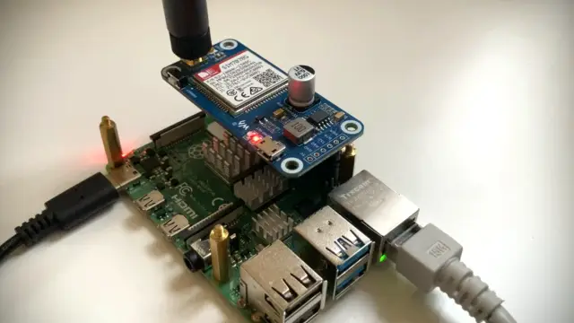
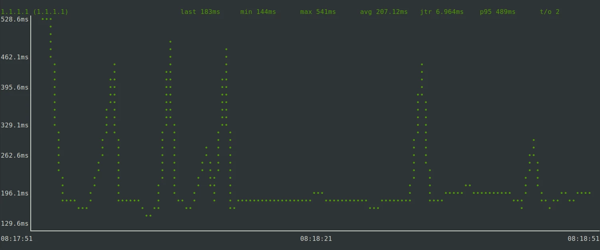

Wir haben uns das "Waveshare SIM7070G Cat-M/NB-IoT/GPRS HAT" für das Raspberry Pi genauer angesehen und in Betrieb genommen. Dabei haben wir verschiedene Fallstricke aufgedeckt und beschreiben im Folgenden, wie wir das NB-IoT Modem eingerichtet haben, um einen unserer [#AMPS Nodes](https://www.zero-iee.com/de/products/) mit dem Internet zu verbinden. 

* Hardware: 
	* Raspberry Pi 4 B
	* Mobilfunk-HAT: [Waveshare SIM7070G Cat-M/NB-IoT/GPRS HAT](https://www.waveshare.com/wiki/SIM7070G_Cat-M/NB-IoT/GPRS_HAT) 
	* SIM-Karte: Telekom M2M
* Software: Raspbian 12 "Bookworm" 




<!--more-->


## Modem an Raspberry Pi anschließen


Das Modem wird - wie jedes andere HAT-Modul über den Raspberry Pin-Header mit dem Raspberry Pi 4 B verbunden. Zusätzlich haben wir das Modul über das mitgelieferte USB-Kabel mit dem Raspberry Pi verbunden, um in einem ersten Schritt zu überprüfen, ob die serielle Konsole wie erwartet funktioniert.

_Auf das USB-Kabel kann später verzichtet werden!_


## Das Modem mit Strom versorgen

Offenbar ist das Mobilfunkmodem zu einem der GPIO Pins des Raspberry Pis verbunden. Indem der GPIO Pin 4 angesteuert wird, wird das Modem ein- oder ausgeschaltet. Nach dem Start sollte der Pin erst einmal auf einen Low-Pegel geschaltet werden, sodass (bedingt durch einen NPN-Transistor am Modul) am SimCom Modem ein High-Pegel anliegt. Der High-Pegel sollte am Eingang dauerhaft anliegen, wenn _keine_ Aktion gewünscht wird. Wird hingegen eine Ein- oder Ausschaltaktion gewünscht, muss an dem SimCom Modem mindestens für eine Sekunde (einschalten) bzw. 1,2 Sekunden (ausschalten) ein Low-Pegel anliegen, bevor zurück auf einen High-Pegel gewechselt wird.

Das initiale Schalten auf den High-Pegel kann so durchgeführt werden:

	echo "4" > /sys/class/gpio/export
	sleep 0.1
	echo "out" > /sys/class/gpio/gpio4/direction
	echo "0" > /sys/class/gpio/gpio4/value

_Erinnerung: "0" bewirkt einen Low-Pegel am NPN-Transistor und daher einen invertierten Pegel "high" am Modem!_

Diese Kommandofolge wird in die Datei `/etc/rc.local` vor die `exit 0` Anweisung gepackt und somit nach jedem Boot einmal ausgeführt. Standardmäßig sollte das Modem nach der Versorgung mit Strom starten.

Wenn das Modem explizit ein- oder ausgeschaltet werden soll, muss der Eingang - wie bereits erwähnt - am Modem für mindestens 1.2 Sekunden auf einen Low-Pegel gezogen werden. Das erreichen wir durch einen kurzen High-Pegel an den Moduleingängen. 

Zum Umschalten der Stromversorgung legen wir ein Script `/home/pi/powertoggle.sh` an, das die folgende Sequenz als Inhalt hat:

```
#!/bin/bash
echo "1" > /sys/class/gpio/gpio4/value
sleep 1.2
echo "0" > /sys/class/gpio/gpio4/value
```

Wird das Script 1x ausgeführt, startet das Modem. Wird es nochmal ausgeführt, wird es heruntergefahren.

Normalerweise muss dieses `powertoggle.sh` Script nach dem Start nicht ausgeführt werden, da das Modem von sich aus startet. Sollte allerdings keine serielle Verbindung zustande kommen, kann es helfen, die Stromversorgung einmal umzuschalten, indem das Script ausgeführt wird.


## Serielle Verbindung zum Modem prüfen

Die Kommunikation mit dem Mobilfunkmodem läuft ausschließlich über eine serielle Verbindung, welche innerhalb von USB bereitgestellt wird. Die Bandbreite der Schnittstelle ist sehr begrenzt, aber im NB-IoT Anwendungsfall völlig ausreichend, denn die zur Verfügung stehende Bandbreite im Mobilfunknetz ist ohnehin minimal und eignet sich nur zur Übermittlung kleinster Datenmengen (Statusinformationen, Sensordaten, Kommandos, ...).

Unser Modem identifiziert sich am USB-Port mit USB Vendor ID `1e0e` und Product ID `9206`:

```
pi@raspberrypi:~ $ lsusb
Bus 002 Device 001: ID 1d6b:0003 Linux Foundation 3.0 root hub
Bus 001 Device 020: ID 1e0e:9206 Qualcomm / Option SimTech SIM7080	<------ SIM7070 Modem
Bus 001 Device 002: ID 2109:3431 VIA Labs, Inc. Hub
Bus 001 Device 001: ID 1d6b:0002 Linux Foundation 2.0 root hub
```

Laut Datenblatt ([SIM7070_SIM7080_SIM7090 Series_Linux_Application Note_V1.02](https://www.simcom.com/product/SIM7070G.html)) bietet das Modem über USB also folgende Schnittstellen an:

* 0: (USB serial): Diagnostic interface
* 1: (USB serial): GPS NMEA interface
* 2: (USB serial): AT port interface
* 3: (USB serial): QFLOG interface
* 4: (USB serial): DAM interface
* 5: (USB serial): Modem port interface

Je nach Product ID kann sich die Portzuordnung unterscheiden - ein Blick ins Datenblatt kann sich daher lohnen. Allerdings befindet sich die für diesen Artikel wichtigste Schnittstelle immer an Position 2: Die AT-Port Schnittstelle. 

Wie im Mobilfunkbereich üblich, wird auch dieses Mobilfunkmodem über sog. AT-Kommandos auf einer serielle Schnittstelle angesteuert. Der Linux Kernel ab Mainline Kernel 5.8.10 enthält die [notwendigen Anpassungen](https://elixir.bootlin.com/linux/v5.8.10/source/drivers/usb/serial/option.c#L1827) im USB Options Treiber, welcher die zuvor erwähnten seriellen Schnittstellen über USB bereitstellt.

Um die AT-Schnittstelle zu testen, genügt es, mittels Minicom eine Verbindung herzustellen. Dazu wird Minicom installiert:

	sudo apt install minicom

... und gestartet:

	sudo minicom -b 115200 -D /dev/ttyUSB2

Danach kann über die Eingabe von 

	AT

geprüft werden, ob AT-Kommandos akzeptiert werden. So stellen wir sicher, dass wir mit der korrekten Konsole sprechen. Kommt ein "OK" zurück, ist alles in Ordnung und das Modem reagiert auf unsere Kommandos. 

Über `STRG+A` und `X` kann Minicom wieder verlassen werden. 


## Auf das Raspberry Pi-eigene Serial Interface umstellen

Wenn wir sicher sind, dass die USB-basierte serielle Kommunikation mit dem Modem funktioniert, können wir auch auf das Raspberry Pi-eigene Serial Interface `ttyS0` umstellen. Das bietet den großen Vorteil, dass keine USB-Verbindung mehr zwischen Raspi und dem Waveshare-Modul bestehen muss: Das USB-Kabel kann entfernt werden. 

Auf dem Raspberry Pi muss die serielle Konsole noch aktiviert und passend eingestellt werden.
Dazu im `raspi-config` Tool "03 Interface options" und dann "I5 Serial Port" wählen. Einstellungen:

* Login Shell: NO
* Serial Port Hardware enabled: YES

Wichtig: Bei "Login shell" muss `NO` gewählt werden. Andernfalls können Kommunikationsprobleme mit dem Modem auftreten. Zum Schluss das Raspi einmal neu starten, um die Einstellungen zu aktivieren. 

Von nun an sollte auch eine serielle Kommunikation über die `/dev/ttyS0` Schnittstelle möglich sein. Wie im Fall oben kann erneut Minicom genutzt werden, um die Verbindung zu überprüfen. 

Tipp: Erscheint nicht sofort eine Antwort auf den "AT" Befehl, kann eine erneute Eingabe zum Erfolg führen. Dazu mehr im Abschnitt _"Modem regiert nicht: Ein Auto Bauding-Problem"_.


## Mit PPP einen IP-Datenkanal öffnen

Um eine IP-Adresse vom Mobilfunkprovider zu bekommen, muss eine PPP-Anmeldung durchgeführt werden. Wir nutzen eine Telekom M2M (Machine-to-Machine) SIM Karte, welche das Telekom NB-IoT Netz unterstützt. Die PPP-Informationen, die im folgenden genannt werden, passen auf das M2M Netz der Telekom und möglicherweise auch auf das einiger Reseller. Für andere Anbieter müssen APN oder evtl. auch mehr Konfigurationsparameter angepasst werden. 

Die PPP-Verbindung stellen wir über den PPP Daemon `pppd` her, der wie folgt installiert wird: 

	sudo apt install ppp

An zwei Stellen muss der PPP Daemon konfiguriert werden. Beginnen wir mit der Providerkonfiguration, die in `/etc/ppp/peers/telekomM2M` angelegt wird:

```
user "m2m"
connect "/usr/sbin/chat -v -f /etc/chatscripts/telekomM2M -T internet.m2mportal.de"

# Serial device to which the modem is connected.
/dev/ttyS0

# Speed of the serial line.
115200

nocrtscts
debug
nodetach
ipcp-accept-local
ipcp-accept-remote

# Assumes that your IP address is allocated dynamically by the ISP.
noipdefault

# Try to get the name server addresses from the ISP.
usepeerdns

# Use this connection as the default route.
defaultroute

# Makes pppd "dial again" when the connection is lost.
persist
maxfail 0
holdoff 5

# Do not ask the remote to authenticate.
noauth
```


* `/etc/chatscripts/telekomM2M` ist der Name des "Chat-Scripts" für die Kommunikation mit dem Modem
* `internet.m2mportal.de` ist der APN-Name des M2M-Netzwerks

Da das Chat-Script `/etc/chatscripts/telekomM2M` noch nicht existiert, wird es nun angelegt:

```
ABORT   "BUSY"
ABORT   "VOICE"
ABORT   "NO CARRIER"
ABORT   "NO DIALTONE"
ABORT   "NO DIAL TONE"
ABORT   "NO ANSWER"
ABORT   "DELAYED"
ABORT   "ERROR"

TIMEOUT 5

''  AT
'OK' AT
OK  ATE1
OK  AT+CGDCONT=1,"IPV4V6","\T","",0,0
OK  ATD*99#
TIMEOUT 22
CONNECT ''
```

Wie auch bei der vorherigen Konfigurationsdatei: Dieses Chat-Script funktioniert möglicherweise nur für das "Telekom M2M" Netz der Deutschen Telekom. Ob es so oder so ähnlich auch für andere Anbieter funktioniert, können wir derzeit nicht sicher sagen. Womöglich kann es aber auch für andere Provider wie z.B. Vodafone eingesetzt werden. 

_Übrigens: Wie haben in dieses Script eine zweite "AT" Abfrage eingebaut, um ein Timing-Problem zu vermeiden. Dazu später mehr unter "Ein Timing-Problem"._

Nun, da beide Konfigurationsdateien fertiggestellt sind, können wir das Modem zum Leben erwecken. Stellt sicher, dass die serielle Konsole `/dev/ttyS0` nicht mehr von Minicom oder einem ähnlichen Terminal verwendet wird und führt folgendes Kommando auf dem Raspberry Pi aus:

	sudo pppd call telekomM2M

Der PPP Daemon versucht nun, sich am Netzwerk anzumelden. Hat er Erfolg, bezieht er vom PPP Server eine IP-Adresse und andere Informationen über eine mobile Datenverbindung. Eine neue Netzwerkschnittstelle `ppp0` wird im Hintergrund eingerichtet. In einem zweiten Konsolenfenster kann dies nachvollzogen werden:

```
pi@raspberrypi:~ $ ip addr
[...]

22: ppp0: <POINTOPOINT,MULTICAST,NOARP,UP,LOWER_UP> mtu 1500 qdisc pfifo_fast state UNKNOWN group default qlen 3
    link/ppp 
    inet 10.155.22.50 peer 10.64.64.64/32 scope global ppp0
       valid_lft forever preferred_lft forever
```

Die (private) IP-Adresse `10.155.22.50` liegt am Interface an und kann ab sofort für die Kommunikation zu anderen Netzwerkteilnehmern oder ins Internet verwendet werden:

	ping -I ppp0 1.1.1.1

**Falls nicht sofort Pings durchkommen: Keine Sorge!** Das NB-IoT M2M Netz ist nicht auf Latenz optimiert. An unserem Standort dauert es ca. 7 Sekunden, bis die ersten Datenpakete zurückgekommen sind. Mit jedem Datenpaket wird die Latenz dann langsam besser, bis wir uns gut 100 ms annähern.

```
pi@raspberrypi:~ $ ping -I ppp0 1.1.1.1
PING 1.1.1.1 (1.1.1.1) from 10.155.22.50 ppp0: 56(84) bytes of data.
64 bytes from 1.1.1.1: icmp_seq=2 ttl=51 time=7002 ms
64 bytes from 1.1.1.1: icmp_seq=3 ttl=51 time=5978 ms
64 bytes from 1.1.1.1: icmp_seq=4 ttl=51 time=5337 ms
64 bytes from 1.1.1.1: icmp_seq=5 ttl=51 time=4313 ms
64 bytes from 1.1.1.1: icmp_seq=8 ttl=51 time=2297 ms
64 bytes from 1.1.1.1: icmp_seq=9 ttl=51 time=2316 ms
64 bytes from 1.1.1.1: icmp_seq=10 ttl=51 time=1315 ms
64 bytes from 1.1.1.1: icmp_seq=11 ttl=51 time=433 ms
64 bytes from 1.1.1.1: icmp_seq=12 ttl=51 time=392 ms
64 bytes from 1.1.1.1: icmp_seq=13 ttl=51 time=393 ms
64 bytes from 1.1.1.1: icmp_seq=14 ttl=51 time=231 ms
64 bytes from 1.1.1.1: icmp_seq=15 ttl=51 time=429 ms
64 bytes from 1.1.1.1: icmp_seq=16 ttl=51 time=268 ms
64 bytes from 1.1.1.1: icmp_seq=17 ttl=51 time=347 ms
64 bytes from 1.1.1.1: icmp_seq=18 ttl=51 time=546 ms
64 bytes from 1.1.1.1: icmp_seq=19 ttl=51 time=163 ms
64 bytes from 1.1.1.1: icmp_seq=20 ttl=51 time=282 ms
64 bytes from 1.1.1.1: icmp_seq=21 ttl=51 time=283 ms
64 bytes from 1.1.1.1: icmp_seq=22 ttl=51 time=139 ms
64 bytes from 1.1.1.1: icmp_seq=23 ttl=51 time=116 ms
64 bytes from 1.1.1.1: icmp_seq=24 ttl=51 time=135 ms
64 bytes from 1.1.1.1: icmp_seq=25 ttl=51 time=154 ms
64 bytes from 1.1.1.1: icmp_seq=26 ttl=51 time=173 ms
^C
--- 1.1.1.1 ping statistics ---
27 packets transmitted, 23 received, 14.8148% packet loss, time 26180ms
rtt min/avg/max/mdev = 116.182/1436.578/7001.561/2066.895 ms, pipe 7
```


In der `/etc/resolv.conf` sind die beiden vom PPP-Daemon bezogenen DNS-Server aufgelistet: 

```
pi@raspberrypi:~ $ cat /etc/resolv.conf
nameserver 10.74.210.210
nameserver 10.74.210.211
```


Somit ist auch eine Namensauflösung über Telekom DNS-Server verfügbar.

Informationen wie zugeordnete IP-Adresse, DNS-Server und Gateway ("remote IP address") werden außerdem in die ppp Daemon Logausgabe geschrieben:

```
[...]
local  IP address 10.155.22.50
remote IP address 10.64.64.64
primary   DNS address 10.74.210.210
secondary DNS address 10.74.210.211
[...]
```

... was leider nicht für die öffentliche IPv6 Adresse gilt, die dem Modem zugeteilt wird: Diese findet sich nur in der Ausgabe von `ip addr show dev ppp0` wieder. Dennoch ist IPv6 ebenso verfügbar: 

	ping -I ppp0 2001:4860:4860::8888


Wer nun das M2M Netzwerk für seinen gesamten Internetverkehr verwenden will, kann die Default-Route darauf umstellen:

```
	sudo ip route del default 
	sudo ip -6 route del default
	sudo ip route add default via 10.64.64.64 dev ppp0
	sudo ip -6 route add default via fe80::1:2:47b1:3706 dev ppp0
```

Die IPv4-Gatewayadresse `10.64.64.64` wurde dem ppp Log entnommen - das IPv6 Pendant  `fe80::1:2:47b1:3706` wurde den IPv6 Routinginformationen mittels `ip -6 route` entnommen.
	

**Übrigens**: der PPP-Daemon scheint relativ rücksichtlos mit den Resolvereinträgen in `/etc/resolv.conf` umzugehen und überschreibt einfach vorhandene Einträge. Belässt man die Standardroute beispielsweise auf dem Ethernet-Interface, kann es sein, dass kein DNS-Resolver mehr erreichbar ist und Namensauflösungen fehlschlagen. Eine nachträgliche Korrektur der `resolv.conf` schafft in diesem Fall Abhilfe. 


## Autostart für den PPP Daemon

Standardmäßig bringt das ppp-Paket in Debian keinen Systemd Service für den PPP Daemon mit - aber kein Problem! Die Paketmaintainer von Arch Linux haben ein passendes [Service-File erstellt](https://gitlab.archlinux.org/archlinux/packaging/packages/ppp/-/blob/main/ppp.systemd?ref_type=heads):

	[Unit]
	Description=PPP link to %I
	Before=network.target
	
	[Service]
	Type=notify
	ExecStart=/usr/sbin/pppd call %I nodetach nolog up_sdnotify
	
	[Install]
	WantedBy=multi-user.target

Dieses können wir unter `/etc/systemd/system/ppp@.service` speichern und den Daemon in den Boot-Autostart aufnehmen:

	sudo systemctl daemon-reload
	sudo systemctl enable ppp@telekomM2M.service

`telekomM2M` ist hier der Name der Datei `/etc/ppp/peers/telekomM2M`. Der Teil muss entsprechend angepasst werden, wenn die PP Konfigurationsdatei anders benannt ist. Dementsprechend ließe sich bei der Verwendung mehrerer Provider-Configs beispielsweise auch ein `sudo systemctl enable ppp@provider2.service` aufrufen. 

Der PPP Daemon kann selbstverständlich auch über ein Systemd "start" Kommando gestartet werden: 

	sudo systemctl start ppp@telekomM2M.service


## Modem regiert nicht: Ein Auto Bauding-Problem

Während unserer Experimente mit Waveshare's SIM7070G-basierten Mobilfunkmodul sind wir auf ein Timing-Problem gestoßen. Wir könnten es lösen, aber es war nicht trivial zu finden, daher wollen wir kurz darauf eingehen. 

### Symptome

Während der ersten Schritte mit dem Modul haben wir nicht das native serielle Interface genutzt, sondern sind den Umweg über den USB-to-Serial Adapter gegangen. Also Raspi => USB-Anschluss des Moduls. Mit diesem Setup funktionierte der PPP-Daemon einwandfrei und wir konnten eine Internetverbindung herstellen. 

Später stellten wir auf die native serielle Verbindung um - also ohne den USB-Anschluss - und nutzten unter Linux statt `/dev/ttyUSB2` das `/dev/ttyS0` Interface, um die Kommunikation über den Raspi Header herzustellen. Allerdings konnte der PPP-Daemon ab diesem Zeitpunkt keine Verbindung mehr herstellen und brach mit einem Timeout ab. 

Unter einer Bedingung konnten wir das Modem in diesem Fall dennoch zur Kommunikation bewegen: Nämlich dann, wenn wir uns vor Ausführung des PPP-Daemons mit einer seriellen Konsole (z.B. Minicom) auf die Schnittstellen aufschalteten und einmal oder mehrmals das "AT" Kommando ausführen, um ein "OK" zurückzubekommen. Das Modem reagierte und bei einem erneuten Start des PPP-Daemons konnte schließlich auch eine Verbindung hergestellt werden. Das Aufschalten mit einem Terminal-Emulator schien also etwas an der Verbindung zurechtzurücken. 

### Die Ursache 

Durch systematisches Ausprobieren und Fixieren der Baudrate am Modem konnten wir schließlich die Ursache finden: Das "Auto-Baud" Feature des Modems - allem Anschein nach in Verbindung mit einem Timing-Problem. 

Das Modem ist ab Werk so eingestellt, dass es keine fest definierte Baudrate akzeptiert, sondern so, dass es versucht, beim ersten "AT" Kommando die Baudrate selbst zu erkennen und zu setzen. Stellt man sein Minicom-Tool also beispielsweise auf eine Baudrate von 115200 ein und schaltet sich auf das serielle Interface auf, führt die Ausführung von "AT" dazu, dass sich das Modem ebenfalls auf 115200 Baud einstellt. Dies erklärt auch, wieso wir nach so einem Schritt den PPP-Daemon niemals dazu bewegen konnten, mit einer anderen Baudrate zu arbeiten. Die erste Verbindung und ihre Baudrate sind nach einem Absetzen von "AP" ausschlaggebend. 

Das erste, was das Modem von unserem Raspi mitbekommen musste, war also ein "AT" String, um seine eigene Baudrate passend konfigurieren zu können. Wir haben im nächsten Schritt unser Chat-Script geprüft und festgestellt, dass das erste Kommando tatsächlich ein "AT" Kommando war. Alles in Ordnung also?

Nicht ganz. Wir haben schließlich herausgefunden, dass wir an der Stelle möglicherweise in ein Timingproblem laufen. Denn die Dokumentation zu einem anderen Mobilfunkmodul des gleichen Herstellers SimCom erwähnt zum Auto-Baud Feature, dass nach dem ersten "AT" eine Weile gewartet werden sollte, bevor weitere Kommandos abgesetzt werden. Andernfalls könnten folgende Kommandos evtl. nicht mehr korrekt interpretiert werden. 

### Die Lösung

Da die ChatScript Syntax keinen "sleep" Befehl oder ähnliches zu kennen scheint, haben wir kurzerhand eine zweite "AT" Abfrage hinzugefügt, um durch diese etwas Zeit zu gewinnen. 

```
''  AT
'OK' AT
```

Und tatsächlich - nun konnten wir auch über die native Serial-Schnittstelle mit dem Modem kommunizieren - ganz ohne vorheriges Aufschalten via Minicom. Der PPP-Daemon lief direkt nach dem Boot. 

Wieso hat es aber über die USB-Serial Verbindung tadellos funktioniert? Wir vermuten, dass die Umwandlung von und zu USB genug Verzögerung im System verursacht, sodass das Timingproblem in diesem Fall nicht auftritt. 


## Eine bessere Lösung für das Power Management

Zu Beginn dieses Beitrags haben wir bereits beschrieben, dass sich das SIM7070G Modul über GPIO4 des Raspberry Pis ein- oder ausschalten lässt. Dabei haben wir allerdings unterschlagen, dass wir den Pin in unserem `powertoggle.sh` Script immer für eine Sekunde auf einen High-Pegel schalten (resultierend in einem Low-Pegel am SIM7070G-Modem).

Tatsächlich offenbart das Datenblatt des Mobilfunkmodems folgendes:

* Low-Pegel für mindestens 1.0 Sekunde: Einschalten
* Low-Pegel für mindestens 1.2 Sekunden: Ausschalten.

Wir können also nicht nur "umschalten" und einen möglicherweise unbekannten Ausgangszustand in sein Gegenteil umkehren, sondern durch präzises Timing beim Schalten gezielt einen "An"- oder "Aus"-Zustand herbeiführen. 

Wir haben zunächst mit Bash-Befehlen experimentiert, aber relativ schnell festgestellt, dass das Timing der Bash-Shell zu ungenau ist, um zuverlässig ein- oder auszuschalten. Daher haben wir ein kleines Tool `modemctl` in C implementiert, das "init", "on" und "off" Argumente annehmen und den GPIO4 Ausgang des Raspis entsprechend präzise ansteuern kann:

Quellcode `modemctl.c`:

```
/*
 * modemctl: Controls Waveshare NB-IoT power state by controlling GPIO pin
 * Installing dependencies: sudo apt install pigpio
 * Compiling: gcc -o modemctl modemctl.c -l pigpio 
 * Running: sudo ./modemctl init 
 *          sudo ./modemctl on 
 *          sudo ./modemctl off
 */
#include <stdio.h>
#include <string.h>
#include <pigpio.h>

#define GPIO_PIN 4      // GPIO number of pin
#define ON_TIME 1.0     // Hold time for turning on
#define OFF_TIME 1.2    // Hold time for turning off

int main(int argc, char *argv[])  {
    if (gpioInitialise() < 0) {
        fprintf(stderr, "pigpio initialisation failed\n");
        return 1;
    }
 
    /* Set GPIO modes */
    gpioSetMode(GPIO_PIN, PI_OUTPUT);

    if (strcmp(argv[1], "init") == 0) {
        printf("Initialising NB-IoT module power state\n");
        gpioWrite(GPIO_PIN, 0);     /* Set pin to low to generate HIGH level on PWR input of module */
    } else if (strcmp(argv[1], "on") == 0) {
        printf("Turning NB-IoT module ON\n");
        gpioWrite(GPIO_PIN, 1);     /* Set GPIO4 to 1 for ON_TIME seconds */
        time_sleep(ON_TIME);
        gpioWrite(GPIO_PIN, 0);
    } else if (strcmp(argv[1], "off") == 0) {
        printf("Turning NB-IoT module OFF\n");
        gpioWrite(GPIO_PIN, 1);    /* Set GPIO4 to 1 for OFF_TIME seconds */
        time_sleep(OFF_TIME);
        gpioWrite(GPIO_PIN, 0);
    } else {
        printf("Please provide \"on\" or \"off\" as an argument!\n");
    }
}
```


Das Programm wird via 

	gcc -o modemctl modemctl.c -l pigpio

kompiliert und kann dann mit sudo gestartet werden, um das Modul zu schalten, z.B. 

	sudo ./modemctl init
	sudo ./modemctl on

... um das Modul einzuschalten. 

Zu beachten ist, dass das Ein- und Ausschalten des Modems einige Sekunden dauern kann und die serielle Schnittstelle nicht unmittelbar danach zur Verfügung steht. 

Am Blinken der "Net" LED am Modul kann das Status abgelesen werden: 

* Kein Blinken: Ausgeschaltet
* Langsames Blinken: Eingeschaltet, aber keine PPP-Verbindung / Datenübertragung
* Schnelles Blinken (~ 800 Sekunden Zyklus): Eingeschaltet und Datenübertragung aktiv


Statt sich darauf zu verlassen, dass das Modem direkt nach dem Boot funktioniert _- wir haben gegenteilige Erfahrungen gemacht -_ können wir also anstelle des `init.sh` Scriptes folgendes in die `/etc/rc.local` aufnehmen:

	/home/pi/modemctl init
	/home/pi/modemctl on

Hiermit sollte das Modem beim Boot nun zuverlässig aktiviert werden. Das `powertoggle.sh` Script wird nicht mehr benötigt.


## Performance

Wie in dem vorher gezeigten ping-Output dargestellt, kann die Latenz der Netzwerkverbindung stark variieren. Wir haben an unserem Standort die Erfahrung gemacht, dass die Latenz zunächst bei einigen Sekunden liegt. Mit anhaltender Datenübertragung sinkt die Latenz aber auf knapp 200 ms. Selbstverständlich eignet sich die Verbindung daher nicht um Übertragen mittlerer oder größerer Datenmengen. Für unsere Anwendungsfälle ist die Verbindung allerdings völlig brauchbar:

* Rollout von Konfigurationsänderungen (SSH / Ansible)
* Übertragung von Statusinformationen
* Übertragung kleiner Firmwareupdates
* Remote-SSH-Login zum Debugging

gping Test:

	gping -i ppp0 -s -n 1.0 -b 60 1.1.1.1




Download-Test mit:

	curl http://speedtest.tele2.net/1GB.zip -o /dev/null -m 60

Wir haben innerhalb eines Gebäudes und in Nähe eines Mobilfunkmasten 9,579 kByte/s (~77 kBit/s) im Download gemessen. Zeitspanne: 60 Sekunden. 

Upload-Test:

	curl -T /dev/urandom http://speedtest.tele2.net/upload.php -O /dev/null -m 60

ähnliche bis leicht höhere Datenraten konnten wir auch im Upload erreichen. Allerdings ist uns wegen Verbindungsabbrüchen kein längerer, durchgängiger Upload-Vorgang gelungen. Die Aussagekraft des Tests ist daher zweifelhaft. Ursache für die Abbrüche ist möglicherweise eine Limitierung der zur Verfügung stehenden "Air Time" im NB-IoT Netz. 

Übrigens: Wer (ungeachtet der Latenz) lokal simulieren will, wie sich eine SSH-Session bei der von uns gemessenen Datenübertragungsrate "anfühlt", kann dazu folgendes Kommando verwenden: 

	ssh -o ProxyCommand='pv -qL 9K | nc %h %p | pv -qL 9K' user@target-machine

Zusammenfassend lässt sich aber sagen, dass die Datenrate für die oben genannten Zwecke ausreichen ist. Dank [Wireguard](https://www.wireguard.com/)'s schlankem VPN Protokoll sind wir sogar in der Lage, verhältnismäßig latenzarme Verbindungen zu unserem [Management VPN](/posts/vpn-firewall-shorewall/) herzustellen. Wir sind gespannt, wie sich das System in ersten Feldversuchen schlagen wird.

---


Quellen:

* [Waveshare Wiki](https://www.waveshare.com/wiki/SIM7070G_Cat-M/NB-IoT/GPRS_HAT)
* [SimCom AT Kommandoreferenz](https://www.waveshare.com/w/upload/3/39/SIM7080_Series_AT_Command_Manual_V1.02.pdf)
* [SimCom Linux Application Note](https://www.waveshare.com/w/upload/4/47/SIM7080_Series_Linux_Application_Note_V1.00.pdf)
* [ChatScript](https://tldp.org/HOWTO/PPP-HOWTO/x1219.html)
* [Auto-Bouding explained in a SIM800 Series datasheet](https://www.digikey.jp/htmldatasheets/production/1833952/0/0/1/sim800-series-at-command-manual.html#pf12)