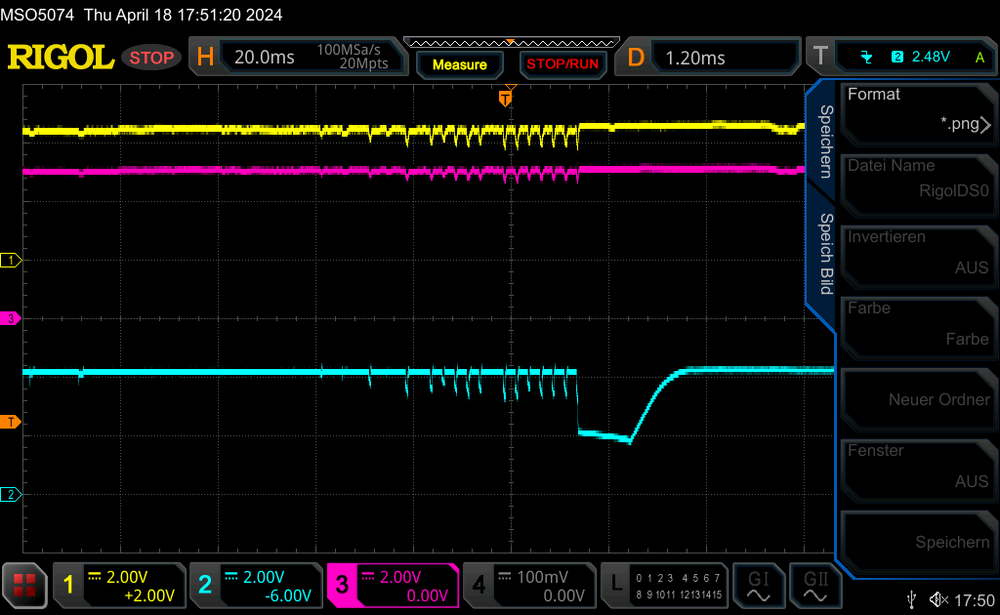
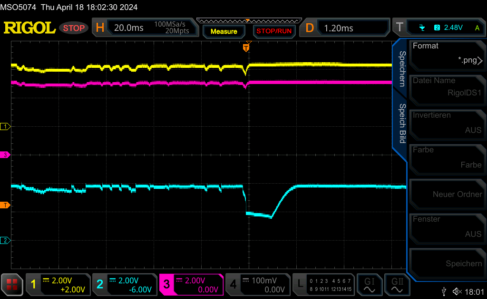
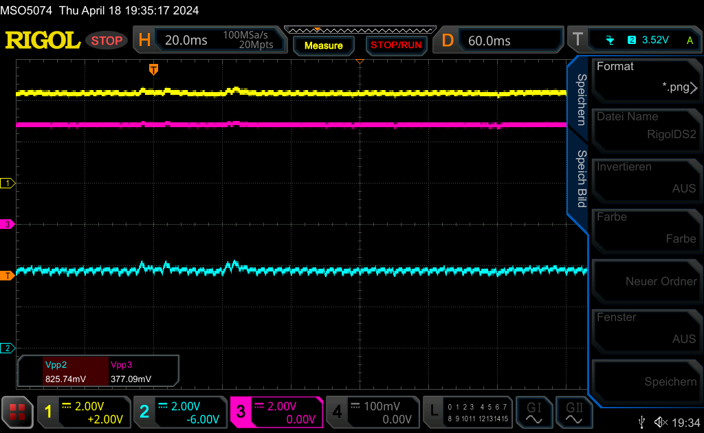
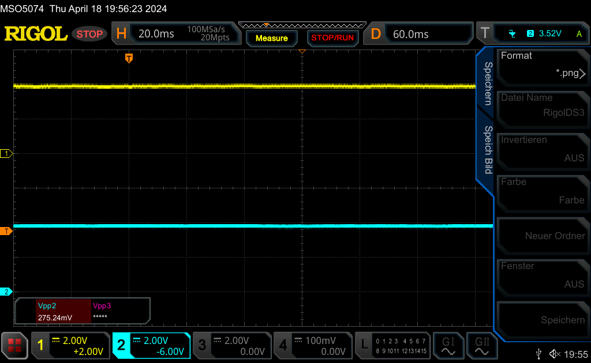

We have written about the Quectel RM520N-GL 5G cellular modem [before](https://blog.zero-iee.com/posts/quectel-rm520n-and-telit-fn990a28-5g-modems-on-raspberrypi-os/). Back then it was about setting up the software to establish a functioning Internet connection under Linux. 

Now there is another article about the modem - but not because everything worked as intended straight away. Rather, this time we want to give you an insight into our daily struggle with and against technology. Because not everything that _should_ work actually works in the end. Even if - as in this case - the electronics have already been used successfully in one way or another. 

For one customer project, we had already successfully selected components that met the customer's stringent requirements: a Raspberry Pi 4 was to form the basis for a mini-computer that was to be connected to the mobile network via a 5G-capable modem. The special feature: as it was to be a _mobile_ mini-computer, there were clear specifications regarding the power supply. The computer was to be powered by a rechargeable battery. 

As mentioned at the beginning, we had already successfully used the modem and were surprised when no mobile connection could be established when the parts were plugged together. We considered the following possible causes: 

1. poor reception at this point in our offices? On the other hand, we had already successfully tested other mobile radio setups here. 
2. poor reception due to too small antennas? Due to the size restrictions, we had to use relatively small antennas. However, larger antennas were of no use in experiments. 
3. possible interference of the antennas by the very close positioned Raspberry Pi or other electronics? However, even equalization of the compact original setup did not bring about any improvement. 
4. possible interference with the USB due to a plugged-in USB stick? In the recent past, we have experienced this mainly in conjunction with USB3 and USB sticks of inferior quality. But unplugging the USB stick didn't help either. 

Finally, a look at the kernel log revealed why no connection could be established: The kernel reported the Quectel modem logging on and off the USB at irregular intervals. In between, several error messages appeared because the modem was not responding to the commands of the modem software as expected. 

We feared we were dealing with a USB fault that was difficult to rectify when we started making comparisons with another Quectel setup. In our original setup, we used a USB M.2 adapter from a manufacturer that still marked this as "Experimental". In order to be able to compare with a guaranteed working reference, we plugged in our Quectel Evaluation Kit instead. In principle, this also consists of a USB-to-M.2 adapter and some onboard antennas. We also plugged the modem itself into the Quectel board from the EK to rule it out as a source of error. 

The result: flawless reception, stable pings. No connection interruptions on the USB bus. So the USB M.2 board from the other manufacturer was targeted early on. However, we have not yet been able to identify the exact cause. 

A few experiments later, the Quectel mobile modem was screwed back into its original adapter board. In the meantime, it had become clear that the USB connection collapsed mainly when the modem was being used. For example, after starting the modem or when it was tasked with searching for a network or establishing a connection to a mobile network. This smelled like a power problem. Finally, the split power supply for the Raspi and modem provided valuable confirmation: If we supplied the two units with two independent batteries via a Y-cable (on the M.2 board), the modem ran flawlessly. Not only was a robust connection established, but the reception was also noticeably better. 

The modem obviously needed a little more power than a single battery could handle. We tested this with a powerful power supply unit, which should now supply the Raspberry Pi and the modem connected to it with sufficient power. The power supply was set to 5V and a current limit of 6A. The modem's data sheet speaks of a short-term maximum current consumption of up to 5A. Maybe our battery was not strong enough?

We were disillusioned to discover that even the powerful power supply unit did not bring any improvement. But what was the problem? We now had a robust power supply after all! To be on the safe side, we also excluded the Raspi's USB ports as a source of error. These only allow a current of 600 mA by default. This limitation can be removed via a [setting](https://www.elektronik-kompendium.de/sites/raspberry-pi/2206111.htm) in `config.txt`, but we decided to supply the modem directly via solder contacts on the M.2 board and a connection to the 5V header pin. Unfortunately, even removing the USB from the power supply path did not bring the hoped-for success. 

A little later and much more perplexed, we pulled out the oscilloscope and decided to measure the voltage levels more precisely at various points in our setup: 

* Directly at the cellular modem (4V) - blue
* At the Raspberry Pi header (5V) - yellow
* At the Raspi voltage input / power supply (5V) - purple

This is the result: 

As can be clearly seen in all three curves, a certain amount of flickering determines the picture. The voltage is by no means stable when the modem is under load, but fluctuates by up to 1 V in some cases. The voltage drop directly at the mobile radio modem is particularly severe. This is because a voltage converter is connected upstream of the modem (on the M.2 board), which suddenly "kinks" under the sudden current demand or switches off briefly as soon as it no longer detects a sufficiently high voltage at its input. Finally, the cell modem kinks and restarts itself - hence the disconnect that we observed on the USB. The unsteadiness in the voltage curve runs through the chain to the power supply unit, as can be clearly seen. With decreasing intensity, but still clearly. 

Although since the Raspberry Pi 4 _no_ [Polyfuse](https://learn.watterott.com/de/raspberrypi/troubleshooting/) has been connected between the USB Power In and 5V rail, which could cause the voltage level on the 5V rail to collapse due to its resistance, we have observed a slight voltage drop between the 5V header pin (yellow) and the USB-C Power In connection. This could possibly be due to the resistance of the conductor tracks on the Raspi board - as these are not necessarily designed for high currents.

We now realized why we had a power problem in the first place and why a single (but powerful!) power supply at this point could not solve the problem. As a makeshift solution, we started experimenting with capacitors at various points: 

* At the 4V supply voltage to the cellular modem
* At the 5V Raspberry Pi header
* At the 5V input of the Raspberry Pi

There was a noticeable improvement when we stabilized the 5V USB supply for the M.2 adapter at the pins on the Raspi header. We chose a 1000 uF electrolytic capacitor for this:

However, we were only able to prevent the M.2 voltage converter from failing at 4V when we integrated additional capacitors at the 4V supply of the modem and the 5V input of the Rapsberry Pi:

Now, however, another symptom appeared: Our measures had created another problem: The kernel's hardware manager complained in red letters about an "undervoltage!". The sudden power demand and the recharging of the capacitors were probably too much for the Raspi traces. Not enough to reset the Raspi, but we took the warning seriously and didn't want to take any risks. Stable operation at the customer's site is extremely important to us.

To eliminate the problem, we therefore decided to no longer supply the Raspi and the M.2 add-on board with power via USB-C, but via the Raspi header or via soldered contacts directly on the M.2 board. From here, both the M.2 board and the Raspi could draw the power over a short distance - the current peaks of the mobile radio module no longer had to be routed via the Raspi tracks. 

With the capacitors and the more centralized power supply, our setup worked perfectly! No more USB crashes and the kernel no longer issued any voltage warnings. But the best thing was: The capacitors turned out to be unnecessary from then on:

The voltage curves are a bit rougher without capacitors than before, but still stable enough not to cause any errors on the modem or microprocessor.

**All that was needed to solve our problem was a power supply via the Raspi header (instead of via the Raspi's USB-C socket) and a direct power supply to the cell modem**

The problem was apparently that the traces on the Raspi are probably not designed for the peak currents generated by the cellular modem and its voltage converter, so that the modem should not be supplied via the Raspi, but directly on the M.2 board. 