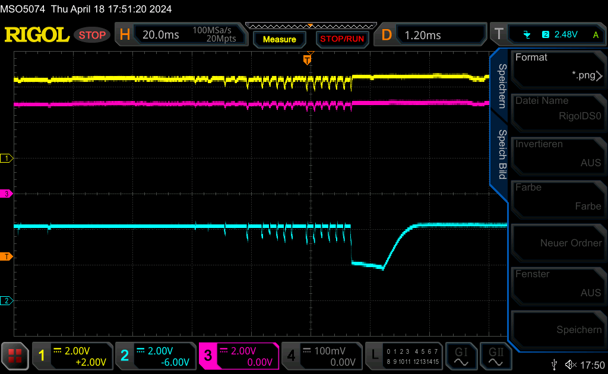
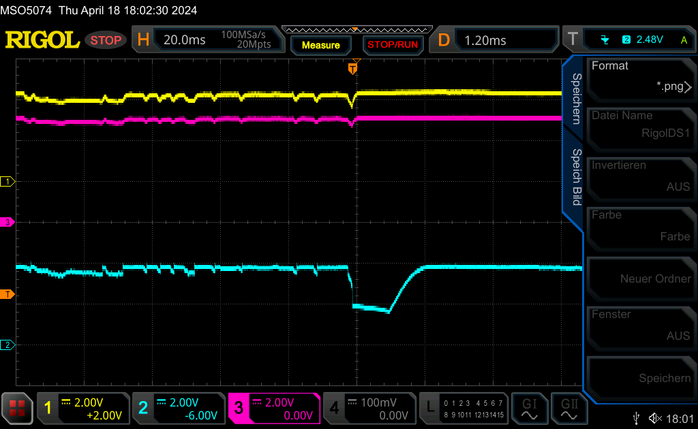

Über das Quectel RM520N-GL 5G Mobilfunkmodem haben wir [schon einmal geschrieben](https://blog.zero-iee.com/posts/quectel-rm520n-and-telit-fn990a28-5g-modems-on-raspberrypi-os/). Damals ging es um die Einrichtung der Software, um unter Linux eine funktionierende Internetverbindung herzustellen. 

Nun gibt es wieder einen Beitrag zu dem Modem - allerdings nicht deswegen, weil auf Anhieb alles wie vorgesehen funktioniert hat. Vielmehr wollen wir euch diesmal einen Einblick in unseren täglichen Kampf mit und gegen die Technik geben. Denn nicht alles, was funktionieren _sollte_, funktioniert am Ende auch. Selbst dann nicht, wenn man - wie in diesem Fall - die Elektronik so oder so ähnlich schon einmal erfolgreich im Einsatz hatte. 

Für ein Kundenprojekt hatten wir schon erfolgreich Bausteine ausgewählt, die den harten Anforderungen des Kunden genügten: Ein Raspberry Pi 4 sollte die Basis für einen Minirechner bilden, der über ein 5G-fähiges Modem ans Mobilfunknetz angebunden sein sollte. Die Besonderheit: Da es sich um einen _mobilen_ Kleinrechner handeln sollte, gab es klare Vorgaben bezüglich der Stromversorgung. Der Rechner sollte nämlich über einen Akku mit Energie gespeist werden. 

Wie eingangs erwähnt, hatten wir das Modem bereits erfolgreich im Einsatz und waren verwundert, als beim Zusammenstecken der Teile keine Mobilfunkverbindung hergestellt werden konnte. Da kamen für uns folgende mögliche Ursachen infrage: 

1. Schlechter Empfang an dieser Stelle in unseren Büros? Andererseits hatten wir hier schon andere Mobilfunksetups erfolgreich getestet. 
2. Schlechter Empfang durch zu kleine Antennen? Durch die Größenbeschränkung mussten wir auf relativ kleine Antennen zurückgreifen. Größere Antennen haben in Experimenten allerdings nichts genutzt. 
3. Evtl. Beeinflussung der Antennen durch das sehr nahe positionierte Raspberry Pi oder andere Elektronik? Allerdings konnte auch eine Entzerrung des kompakten Originalsetups keine Besserung bewirken. 
4. Möglicherweise Störung des USB durch einen angesteckten USB-Stick? Den Fall hatten wir in jüngerer Vergangenheit vor allem im Zusammenspiel mit USB3 und USB-Sticks minderer Qualität gemacht. Aber auch ein Abstecken des USB-Sticks nutzte nichts. 

Schließlich offenbarte ein Blick ins Kernel-Log, wieso keine Verbindung zustande kommen konnte: Der Kernel meldete in unregelmäßigen Abständen das An- und Abmelden des Quectel-Modems am USB. Dazwischen einige Fehlermeldungen, die erschienen, weil das Modem nicht wie erwartet auf die Kommandos der Modemsoftware reagierte. 

Wir befürchteten schon, es mit einer schwer zu behebenden USB-Störung zu tun zu haben, als wir anfingen, Vergleiche mit einem anderen Quectel Aufbau anzustellen. In unserem Originalaufbau nutzten wir einen USB-M.2 Adapter eines Herstellers, der dieses noch als "Experimentell" markierte. Um mit einer garantiert funktionierende Referenz vergleichen zu können, steckten wir stattdessen unser Quectel Evaluation Kit an. Dieses besteht im Prinzip auch aus einem USB-zu-M.2 Adapter und einigen Onboard-Antennen. Das Modem selbst steckten wir ebenfalls in das Quectel Board aus dem EK, um es als Fehlerquelle ausschließen zu können. 

Das Ergebnis: Einwandfreier Empfang, stabile Pings. Keine Verbindungsabbrüche auf dem USB-Bus. So geriet das USB-M.2 Board des anderen Herstellers früh ins Visier. Die genaue Ursache konnten wir aber noch nicht benennen. 

Ein paar Experimente später war das Quectel Mobilfunkmodem wieder in seinem ursprünglichen Adapterboard eingeschraubt. In der Zwischenzeit hatte sich herauskristallisiert, dass die USB-Verbindung vor allem dann zusammenbrach, wenn das Modem beansprucht wurde. Also etwa nach dem Start des selbigen oder wenn es mit der Netzsuche oder dem Verbindungsaufbau in ein Mobilfunknetz beauftragt wurde. Das roch nach einem Stromproblem. Schließlich brachte die aufgeteilte Stromversorgung von Raspi und Modem eine wertvolle Bestätigung: Versorgten wir die beiden Einheiten über ein Y-Kabel (am M.2 Board) mit zwei voneinander unabhängigen Akkus, lief das Modem einwandfrei. Es kam nicht nur eine robuste Verbindung zustande, sondern auch der Empfang war nun merklich besser. 

Das Modem brauchte also offenbar etwas mehr Leistung, als ein einzelner Akku stemmen konnte. Wir machten die Probe mit einem leistungsstarken Netzteil, das nun das Raspberry Pi und das daran angeschlossene Modem mit ausreichend Leistung versorgen sollte. Das Netzteil wurde auf 5V und eine Stromgrenze von 6A eingestellt. Das Datenblatt des Modems spricht von einer kurzzeitigen, maximalen Stromaufnahme von bis zu 5A. Möglicherweise war unser Akku nicht stark genug?

Ernüchtert stellten wir fest, dass auch das starke Netzteil keine Besserung brachte. Doch wo war noch das Problem? Für eine robuste Spannungsversorgung war nun doch gesorgt! Zur Sicherheit klammerten wir auch die USB-Ports des Raspis als Fehlerquelle aus. Diese lassen per default nur einen Strom von 600 mA zu. Über eine [Einstellung](https://www.elektronik-kompendium.de/sites/raspberry-pi/2206111.htm) in der `config.txt` kann diese Limitierung zwar aufgehoben werden, aber wir entschlossen uns, das Modem lieber direkt über Lötkontakte auf dem M.2 Board und eine Verbindung zum 5V Header Pin zu versorgen. Leider brachte auch das Entfernen des USB aus dem Stromversorgungs-Pfad nicht den erhofften Erfolg. 

Ein wenig später und viel ratloser zückten wir das Oszilloskop und nahmen uns vor, die Spannungspegel an verschiedenen Stellen unseres Setups genauer zu messen: 

* Direkt am Mobilfunkmodem (4V) - blau
* Am Raspberry Pi Header (5V) - gelb
* Am Raspi Spannungseingang / Netzteil (5V) - violett

Es offenbarte sich dieser Anblick: 

Wie deutlich an allen drei Kurven zu sehen ist, bestimmt ein gewisses Flimmern das Bild. Die Spannung ist keineswegs stabil, wenn das Modem beansprucht wird, sondern schwankt zum Teil bis zu 1 V. Besonders heftig ist der Spannungseinbruch direkt am Mobilfunkmodem. Dieser kommt daher, dass dem Modem (auf dem M.2 Board) ein Spannungswandler vorgeschaltet ist, der unter dem plötzlichen Strombedarf auf einmal "webknickt" bzw. kurzzeitig abschaltet, sobald er seinerseits keine ausreichend hohe Spannung mehr an seinem Eingang detektiert. Schließlich knickt das Mobilfunkmodem ein und startet sich neu - daher kommt der Disconnect, den wir am USB beobachten konnten. Die Unruhe in der Spannungskurve zieht sich - wie sich schön nachvollziehen lässt - in der Kette bis zum Netzteil durch. Mit nachlassender Intensität, aber dennoch deutlich. 

Obwohl seit dem Raspberry Pi 4 _keine_ [Polyfuse](https://learn.watterott.com/de/raspberrypi/troubleshooting/) mehr zwischen USB Power In und 5V Rail geschaltet ist, die durch ihren Widerstand den Spannungspegel auf der 5V Rail einbrechen lassen könnte, beobachten wir einen leichten Spannungsabfall zwischen dem 5V Header-Pin (gelb) und dem USB-C Power In Anschluss. Dieser könnte evtl. auf den Widerstand der Leiterbahnen auf das Raspi Platine zurückzuführen sein - denn diese sind nicht unbedingt für hohe Ströme ausgelegt.

Uns war nun klar, wieso wir überhaupt ein Stromproblem hatten und wieso ein einzelnes (aber starkes!) Netzteil an dieser Stelle das Problem nicht beheben konnte. Behelfsmäßig begannen wir, mit Kondensatoren an verschiedenen Stellen zu experimentieren: 

* An der 4V Versorgungsspannung zum Mobilfunkmodem
* Am 5V Raspberry Pi Header
* Am 5V Eingang des Raspberry Pi

Eine merkliche Besserung zeichnete sich ab, als wir die 5V-USB-Versorgung für den M.2 Adapter an den Pins am Raspi-Header stabilisierten. Wir wählten hierzu einen 1000 uF-Elektrolytkondensator:

Ein Versagen des M.2 Spannungswandlers auf 4V konnten wir allerdings erst verhindern, als wir weitere Kondensatoren an der 4V-Versorgung des Modems und dem 5V-Eingang des Rapsberry Pi's integrierten:

Nun zeigte sich aber ein anderes Symptom: Durch unsere Maßnahmen hatten wir nun ein anderes Problem geschaffen: Der Hardwaremanager des Kernels beschwerte sich in roter Schrift über eine "Undervoltage!". Der plötzliche Strombedarf und das Nachladen der Kondensatoren waren vermutlich zu viel für die Raspi-Leiterbahnen. Noch nicht genug, um das Raspi zu resetten, aber die Warnung namen wir ernst und wollten kein Risiko eingehen. Ein stabiler Betrieb beim Kunden ist uns äußerst wichtig.

Um das Problem zu beseitigen, entschieden wir uns daher, das Raspi und das M.2 Aufsatzboard nicht mehr weiter über USB-C mit Strom zu versorgen, sondern über den Raspi-Header bzw. über angelötete Kontakte direkt am M.2 Board. Denn von hier aus konnten sowohl das M.2 Board als auch das Raspi die Leistung über kurze Strecke beziehen - die Stromspitzen des Mobilfunkmoduls mussten nicht mehr über die Raspi-Leiterbahnen geleitet werden. 

Mit den Kondensatoren und der zentraleren Stromversorgung lief unser Setup einwandfrei! Keine Abbrüche mehr beim USB und auch der Kernel gab keine Spannungswarnungen mehr aus. Doch das Beste war: Die Kondensatoren stellten sich von da an als verzichtbar heraus:

Die Spannungskurven sind ohne Kondensatoren zwar etwas rauer als vorher, aber immer noch stabil genug, um keine Fehler am Modem oder Mikroprozessor zu verursachen.

**Alles, was für die Behebung unseres Problems nötig war, war also eine Stromversorgung über den Raspi-Header (anstatt über die USB-C Buchse des Raspis) und eine direkte Stromversorgung des Mobilfunkmodems**

Das Problem war offenbar, dass die Leiterbahnen auf dem Raspi vermutlich nicht für die durch das Mobilfunkmodem und dessen Spannungswandler erzeugten Spitzenströme ausgelegt sind, sodass eine Versorgung des Modems nicht über das Raspi erfolgen sollte, sondern direkt am M.2 Board. 

_... wie wir bei der ZERO GmbH gerne sagen: "Again what learned!" ;-)_